# Hummingbot MQTT Monitor & Alert Service

A monitoring service that subscribes to Hummingbot MQTT events and sends real-time alerts via Telegram when bots stop due to drawdown, errors, or other critical events.

## Features

- **Real-time MQTT Monitoring**: Subscribes to all Hummingbot bot events via EMQX broker
- **Smart Event Detection**: Automatically detects:
  - Drawdown limit hits (global and per-controller)
  - Bot stops and errors
  - Critical log messages
  - Status changes
- **Telegram Alerts**: Send alerts via Telegram Bot API
- **Deduplication**: Prevents duplicate alerts for the same event
- **Configurable**: YAML-based configuration without code changes
- **Docker-ready**: Can be deployed as standalone service or Docker container
- **Production-ready**: Proper logging, error handling, and reconnection logic

## Architecture

### High-Level Overview


### MQTT Topics Architecture


The service subscribes to MQTT topics:
- `hbot/+/log` - Bot log messages (INFO, WARNING, ERROR)
- `hbot/+/notify` - User notifications
- `hbot/+/status_updates` - Bot status changes (start/stop)
- `hbot/+/events` - Internal trading events
- `hbot/+/hb` - Heartbeat messages (every 60s)

## Event Detection Flow

### Bot Lifecycle Monitoring

```mermaid
stateDiagram-v2
    [*] --> Unknown
    Unknown --> Online: Bot Started
    Online --> Offline: Bot Stopped
    Offline --> Online: Bot Restarted
    
    Online --> HeartbeatTimeout: No heartbeat\n(5 minutes)
    HeartbeatTimeout --> Online: Heartbeat Received
    HeartbeatTimeout --> Crashed: Still no heartbeat
    
    note right of Online
        ✅ Agent Started
        INFO Level Alert
    end note
    
    note right of Offline
        🛑 Agent Stopped
        WARNING Level Alert
    end note
    
    note right of HeartbeatTimeout
        ⚠️ Heartbeat Timeout
        WARNING Level Alert
    end note
    
    note right of Crashed
        💥 Agent Crashed
        ERROR Level Alert
    end note
```



### Alert Priority & Routing


## Getting Started

### Quick Start with Docker (Recommended)

The easiest way to deploy `hb-monitor` is using Docker Compose:

```bash
# 1. Clone and navigate
cd hb-monitor

# 2. Configure
cp config.example.yml config.yml
nano config.yml  # Edit with your Telegram bot token and MQTT settings

# 3. Deploy
docker compose up -d

# 4. View logs
docker compose logs -f
```

Common Docker commands you’ll use while operating the monitor:

```bash
# Build (or rebuild) the image
docker compose build

# Start in detached mode (build if needed)
docker compose up -d --build

# Stop containers but keep the network/volumes
docker compose down

# Follow container logs in real time
docker compose logs -f

# Tail only hb-monitor logs (when multiple services exist)
docker compose logs -f hb-monitor

# View container status
docker compose ps

# Remove stopped containers + networks + images (cleanup)
docker compose down --rmi all --volumes


docker compose restart
```

> These commands should be run from the `hb-monitor` directory on the server (the same folder that contains `docker-compose.yml`).

### Manual Installation (Python)

If you prefer to run without Docker:

#### 1. Installation

Clone the repository (or copy the `hb-monitor` folder into your workspace) and install dependencies:

```bash
cd hb-monitor
pip install -r requirements.txt
```

#### 2. Configure

Create a configuration file from the example and adjust it to your environment:

```bash
cp config.example.yml config.yml
```

Important sections (explained in detail below):

- `mqtt`: broker location and credentials
- `alerts.telegram`: bot token and chat id
- `alerts.telegram.source_aliases`: optional map to rewrite topic prefixes (e.g., `"hbot/" -> "agent/"`) before they show up in Telegram `Source` lines
- `filters.log_levels`: allowed severities for log-topic payloads (keep `INFO` so first-run/start/stop summaries surface)
- `filters.log_filter.pattern`: regex allow-list that every message must match before it can alert
- `subscriptions`: comment/uncomment topics to control what is monitored

#### 3. Run

Start the monitor with the configuration you created:

```bash
CONFIG_PATH=config.yml python main.py
```

## Running Locally with an SSH Tunnel

If your MQTT broker lives on a remote server, the easiest way to test locally is to forward port 1883 over SSH:

   ```bash
ssh -i /path/to/key.pem -L 1883:localhost:1883 user@your-server -N
   ```

In another terminal (still on your local machine):

```bash
CONFIG_PATH=config.local.yml python main.py
```

You can also watch raw traffic with `mosquitto_sub` if you installed `mosquitto-clients` locally:

```bash
mosquitto_sub -h localhost -p 1883 -t 'hbot/+/events' -v
```

## Running on a Server

If the monitor runs on the same host as the broker, simply point the configuration at the internal address (e.g. `host: "emqx"` if you are using the Hummingbot `deploy` stack). You can run the service with:

```bash
CONFIG_PATH=/app/config.yml python main.py
```

### Keeping it alive

- **tmux/screen:** start the monitor inside a session you can detach, e.g. `tmux new -s hbmonitor`, run the command, then `Ctrl+B, D` to detach.
- **Background job:** `nohup CONFIG_PATH=config.yml python main.py >> hb-monitor.out 2>&1 &`
- **systemd service (recommended for production):**

  `/etc/systemd/system/hb-monitor.service`
  ```ini
  [Unit]
  Description=Hummingbot MQTT Monitor
  After=network.target

  [Service]
  Type=simple
  WorkingDirectory=/path/to/hb-monitor
  ExecStart=/usr/bin/python CONFIG_PATH=config.yml python main.py
  Restart=always
  RestartSec=5
  Environment=PYTHONUNBUFFERED=1

  [Install]
  WantedBy=multi-user.target
  ```
  Then run:
  ```bash
  sudo systemctl daemon-reload
  sudo systemctl enable hb-monitor
  sudo systemctl start hb-monitor
  sudo journalctl -u hb-monitor -f   # follow logs
  ```

Docker Compose users can add a service pointing at `./hb-monitor` with `restart: unless-stopped`.

## Deployment Architecture

### Production Deployment Options


## Configuration Reference

The example file contains sane defaults and highlights optional sections:

```yaml
mqtt:
  host: "emqx"  # "localhost" if tunnelling, broker name if running alongside EMQX
  port: 1883
  username: ""  # Optional
  password: ""  # Optional

alerts:
  telegram:
    enabled: true
    bot_token: "YOUR_BOT_TOKEN"
    chat_id: "YOUR_CHAT_ID"
    use_markdown: true

filters:
  # Only alert for these bot IDs (empty = all bots)
  bot_ids: []

  # Alert on these log levels (raised topics can still be further filtered)
  log_levels: ["ERROR", "WARNING", "INFO"]  # INFO keeps lifecycle (start/stop) context visible

  # Keywords applied to non-log topics (status/event/notify)
  alert_keywords:
    - "drawdown"
    - "error"
    - "failed"
    - "exception"

  # Deduplication window (seconds)
  deduplication_window: 300

  # Ignore these keywords (to reduce noise on non-log topics)
  ignore_keywords:
    - "DEBUG"
    - "heartbeat"

  # Optional regex filter applied to every topic (case-insensitive).
  # Only messages matching this pattern are eligible to trigger Telegram alerts.
  log_filter:
    pattern: "(drawdown|draw\\s*down|max drawdown|stopping the strategy|stopping the controller|strategy stopped successfully|clock stopped successfully|bot stopped|bot started|offline|online|heartbeat timeout|crashed)"

monitoring:
  log_file: "logs/hb-monitor-local.log"
  log_level: "INFO"
  heartbeat_timeout: 300          # seconds without a heartbeat before alerting
  heartbeat_check_interval: 60    # how often to evaluate heartbeat status
  post_stop_silence_grace: 0      # suppress further alerts for the bot after stop (0 = immediate)
  console_trade_filter:
    suppress: true                # avoid printing trade/order noise to stdout
    keywords: ["order", "trade", "position", "filled", "budget"]
    # pattern: "(order|trade|budget)"  # optional regex override for finer control

subscriptions:
  # Comment/uncomment to control which MQTT topics are monitored.
  - topic: "hbot/+/log"            # log and drawdown alerts (filtered by the regex above)
    qos: 1
  - topic: "hbot/+/status_updates" # start/stop/offline lifecycle messages
    qos: 1
  # - topic: "hbot/+/events"        # trading events (order filled, order failure, etc.)
  #   qos: 1
  # - topic: "hbot/+/notify"        # CLI/Telegram style notifications
  #   qos: 1
  # - topic: "hbot/+/hb"            # raw heartbeat pings (left commented if heartbeat_timeout is enough)
  #   qos: 1
```

## Data Flow & Integration

### Complete System Integration

```mermaid
sequenceDiagram
    participant HB as Hummingbot Bot
    participant EMQX as EMQX Broker
    participant MON as hb-monitor
    participant TG as Telegram API
    participant USER as User Device
    
    Note over HB: Bot detects drawdown
    HB->>EMQX: Publish to hbot/bot1/log<br/>"Controller X reached max drawdown"
    EMQX->>MON: Forward message
    
    Note over MON: Process message
    MON->>MON: Check filters
    MON->>MON: Detect controller drawdown
    MON->>MON: Check deduplication
    MON->>MON: Format alert message
    
    MON->>TG: POST /sendMessage<br/>⚠️ Controller Drawdown Alert
    TG->>USER: Push notification
    
    Note over USER: User sees alert on phone
    
    Note over HB: Bot continues running
    HB->>EMQX: Publish heartbeat every 60s
    EMQX->>MON: Forward heartbeat
    MON->>MON: Update timestamp
    
    Note over MON: 5 minutes later...
    alt No heartbeat received
        MON->>MON: Detect timeout
        MON->>TG: POST /sendMessage<br/>⚠️ Heartbeat Timeout
        TG->>USER: Push notification
    end
```



### Filtering & Deduplication Logic


### State Management


### Log Filtering Strategy

- Drawdown and strategy-stop events are published as log messages by the Hummingbot controllers (`v2_with_controllers.py`), so include those phrases in the regex allow-list.
- The monitor always prints every received message to stdout/log files for visibility; Telegram alerts remain gated by the regex and keyword filters.
- To reduce noise from exchange connection retries or balance warnings, tighten the regex or comment out topics you do not care about.
- Heartbeat alerts are handled separately via `heartbeat_timeout` and do not require the raw heartbeat topic to be enabled.
- To keep terminal output readable, `console_trade_filter` suppresses trade/order-specific log lines from stdout while still allowing alerts and file logging. Adjust the keywords or regex to suit your environment (set `suppress: false` to disable).

## Alert Examples

### Telegram Message Formats

```mermaid
graph LR
    subgraph "Alert Types"
        A[🚨 Global Drawdown<br/>ERROR]
        B[⚠️ Controller Drawdown<br/>WARNING]
        C[🛑 Bot Stopped<br/>WARNING]
        D[✅ Bot Started<br/>INFO]
        E[⚠️ Heartbeat Timeout<br/>WARNING]
        F[💥 Bot Crashed<br/>ERROR]
    end
    
    A --> G[Telegram Message]
    B --> G
    C --> G
    D --> G
    E --> G
    F --> G
    
    G --> H[Your Phone]
    G --> I[Your Desktop]
    G --> J[Your Tablet]
    
    style A fill:#f44336,stroke:#c62828,stroke-width:3px,color:#fff
    style B fill:#ff9800,stroke:#e65100,stroke-width:2px,color:#fff
    style C fill:#ff9800,stroke:#e65100,stroke-width:2px,color:#fff
    style D fill:#4caf50,stroke:#2e7d32,stroke-width:2px,color:#fff
    style E fill:#ff9800,stroke:#e65100,stroke-width:2px,color:#fff
    style F fill:#f44336,stroke:#c62828,stroke-width:3px,color:#fff
```



**Example Alert Messages:**

**Global Drawdown (Most Critical):**
```
🚨 GLOBAL DRAWDOWN REACHED

Container: PMM_GATE_200bp-20251113-0800
Level: CRITICAL
Type: Global Strategy Drawdown

⚠️ The entire strategy has reached max global drawdown.
All controllers are being stopped.

Details: Global drawdown reached. Stopping the strategy.

Source: agent/PMM_GATE_200bp-20251113-0800/log
Time: 2025-11-19 17:46:31
```

**Controller Drawdown:**
```
⚠️ Controller Drawdown Reached

Container: PMM_GATE_200bp-20251113-0800
Controller: bearish_gate_200bp_0.1
Level: WARNING
Type: Controller Drawdown

This controller has reached max drawdown and is being stopped.
Other controllers may continue running.

Details: Controller bearish_gate_200bp_0.1 reached max drawdown.

Source: agent/PMM_GATE_200bp-20251113-0800/log
Time: 2025-11-19 15:48:52
```

**Bot Started:**
```
✅ Agent Started

Container: PMM_GATE_200-20251119-1747
Status: online
Type: availability

Agent is now running.

Source: agent/PMM_GATE_200-20251119-1747/status_updates
Time: 2025-11-19 17:47:12
```

## Telegram Integration & Security

- **BotFather** is Telegram’s official bot-management tool. You interact with it from the Telegram app; all traffic is encrypted. Once it gives you a token, Telegram never contacts your server unsolicited—the monitor only makes outbound HTTPS requests to `https://api.telegram.org/bot<token>/sendMessage`.
- **Keep the token secret.** Anyone with the token can send messages as your bot. Store it in `config.yml`/`config.local.yml` (both ignored by Git) or load it from environment variables. Never commit real tokens or chat IDs.
- **Group privacy:** To allow the bot to “see” group messages (needed to look up the group chat id), disable privacy in BotFather (`/setprivacy -> Turn off`), add the bot to the group, send any message, then call `getUpdates` once to capture the `chat.id`.
- **Why the bot can’t hack the server:** The Bot API is stateless HTTPS—you push messages to Telegram, not the other way around. Unless you expose your own webhook endpoint, Telegram has no path into your infrastructure.
- **Rotation:** If you suspect a leak, revoke the token in BotFather (`/token -> Revoke current token`) and update your config with the new one.

## Getting Telegram Bot Token

1. Open Telegram and search for `@BotFather`
2. Send `/newbot` and follow instructions
3. Copy the bot token
4. Start a chat with your bot and send any message
5. Visit `https://api.telegram.org/bot<YOUR_TOKEN>/getUpdates`
6. Find your `chat_id` in the response

## Useful Log Commands

```bash
# Tail monitor output
tail -f logs/hb-monitor-local.log

# Tail a bot log (replace bot name as needed)
tail -f hm-deploy/bots/instances/BEARISH_CRYPTO-*/logs/logs_hummingbot.log

# Search for drawdown/stop messages across all bot logs
find hm-deploy/bots/instances -path "*/logs/logs_hummingbot.log" \
  -exec grep -niE "draw.?down|stopping the strategy|stopping the controller|crashed|bot stopped" {} +
```

## Troubleshooting

- **No alerts received**: Check MQTT connection, verify bot is publishing events
- **Duplicate alerts**: Adjust `deduplication_window` in config
- **Connection errors**: Verify EMQX broker is running and accessible
- **Telegram errors**: Verify bot token and chat_id are correct

## License

Apache License 2.0

Related projects: [hummingbot/brokers](https://github.com/hummingbot/brokers)